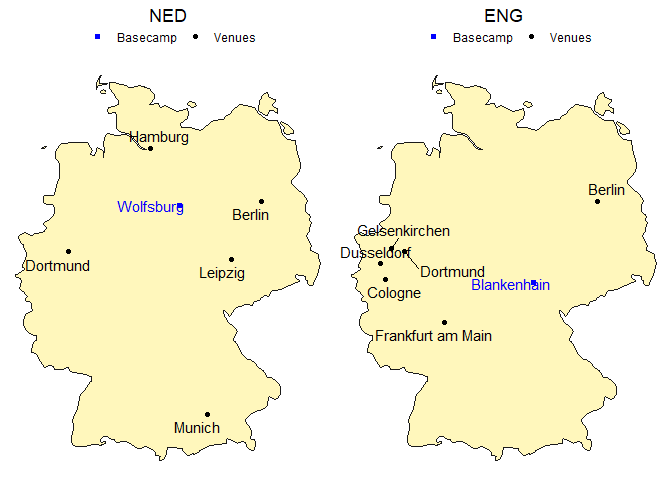

# European Football Championship 2024

- [Quantitative Comparison of Netherlands vs
  England](#quantitative-comparison-of-netherlands-vs-england)
  - [Mapping the Journey](#mapping-the-journey)
  - [Descriptive Analytics](#descriptive-analytics)
  - [Conclusion](#conclusion)
  - [References](#references)

<details>
<summary>Code</summary>

``` r
# Parameters are set in yaml header and retrieved here
my_teams <- 
  tibble(
    code = c(params$code_a, params$code_b),
    fullname = c(params$fullname_a, params$fullname_b))

# # Same as
# my_teams <-
#   tibble(
#     code = c("NED", "ENG"),
#     fullname = c("Netherlands", "England"))
```

</details>

## Quantitative Comparison of Netherlands vs England

The clash between Netherlands and England in Euro 2024 semifinals is set
to be a thrilling and highly anticipated match. Check out this
quantitative comparison between the two teams.

### Mapping the Journey

Here are the teams’ venues and training camps across the Euro 2024.

<details>
<summary>Code</summary>

``` r
# Write function for plotting
plot_team_journey <- function(team, show_legend = TRUE) {
  match_data <- euro_matches_2024 %>% 
    filter(home_team_code == team | away_team_code == team)
  
  basecamp_data <- filter(basecamps, team_code == team)
  
  ggplot() +
    # Plot German map with map package data
    geom_polygon(data = germany,
                 aes(x = long, y = lat, group = group),
                 colour = "grey10", fill = "#fff7bc") +
    geom_point(data = match_data,
               aes(x = stadium_longitude, y = stadium_latitude, color = "Venues")) +
    geom_point(data = basecamp_data,
               aes(x = long, y = lat, color = "Basecamp"), shape = 15) +
    geom_text(data = basecamp_data,
              aes(label = basecamp, x = long, y = lat, color = "Basecamp"),
              hjust = -0.05) +
    geom_text(data = match_data,
              aes(label = stadium_city, x = stadium_longitude, y = stadium_latitude, color = "Venues"),
              hjust = -0.05) +
    scale_color_manual(name = "",
                       values = c("Venues" = "black", "Basecamp" = "blue")) +
    theme_void() +
    # Use paste() function to enquote team variable
    ggtitle(paste0(team)) +
    theme(plot.title = element_text(hjust = 0.5),
          legend.position = "top")
}

# Show both plots in the same pane
grid.arrange(plot_team_journey(my_teams$code[1]),
             plot_team_journey(my_teams$code[2]),
             ncol = 2)
```

</details>



### Descriptive Analytics

<details>
<summary>Code</summary>

``` r
euro_matches_2024_pivoted <- euro_matches_2024 %>%
  select(id_match, starts_with("home"), starts_with("away")) %>% 
  pivot_longer(
    # pivot all columns except id_match
    cols = -id_match,
    # split into multiple columns 
    names_to = c("Location", # receives the values "home" or "away"
                 ".value"), # the remaining part of the column names should become the names of the new columns
    names_pattern = "(home|away)_(.*)") # how to split into multiple columns (".*" matches the ".value" from before)

euro_matches_2024_pivoted_joined <- euro_matches_2024_pivoted %>% 
  left_join(euro_matches_2024_pivoted,
            join_by(id_match),
            suffix = c("", "_against"),
            # set relationship to silence the warning
            relationship = "many-to-many") %>%
  filter(team != team_against)
```

</details>

**Scoring dynamics**: comparing the number of goals scored and received
by each team throughout the tournament.

<details>
<summary>Code</summary>

``` r
euro_matches_2024_pivoted_joined_goal_summary <- euro_matches_2024_pivoted_joined %>% 
  filter(!is.na(score)) %>% 
  group_by(Team = team) %>% # group_by() and rename
  summarise(
    `Matches played` = n(),
    `Goals scored` = sum(score),
    `Goals received` = sum(score_against),
    `Goals scored per match` = mean(score),
    `Goals received per match` = mean(score_against))

euro_matches_2024_pivoted_joined_goal_summary %>% 
  select(1:4) %>% 
  filter(Team %in% c(my_teams$fullname)) %>% 
  kable()
```

</details>

| Team        | Matches played | Goals scored | Goals received |
|:------------|---------------:|-------------:|---------------:|
| England     |              5 |            4 |              3 |
| Netherlands |              5 |            9 |              5 |

Let’s put this poor performance in visual relation to all other teams.

<details>
<summary>Code</summary>

``` r
euro_matches_2024_pivoted_joined_goal_summary %>% 
  ggplot(aes(x = `Goals scored per match`,
             y = `Goals received per match`)) +
  geom_point(aes(colour = Team %in% c(my_teams$fullname),
                 size = Team %in% c(my_teams$fullname))) +
  geom_text_repel(aes(label = Team,
                      colour = Team %in% c(my_teams$fullname)),
                  nudge_y = .05) +
  scale_size_manual(values = c(2, 3)) +
  scale_color_manual(values = c("black", "red")) +
  theme(legend.position = "none")
```

</details>


**Inside the teams**: what are their strengths and weaknesses?

For each team, we look at the average per player of

- International appearances (caps): reflecting a player’s experience and
  consistency at the international level.
- Goals (in international matches): indicating a team’s offensive
  capability.
- Market value: providing insight into each player’s perceived worth
  based on market demand.
- Height: a strategic factor that was highlighted by former German
  national keeper Jens Lehmann as a disadvantage for Spain’s team before
  playing against Germany. They won anyways, so how much does height
  really matter when comparing two teams?
- Age: indicating the balance between youthful energy and veteran
  experience.

<details>
<summary>Code</summary>

``` r
euro_2024_players_summary <- euro_2024_players %>% 
  group_by(Country) %>% 
  summarise(avg_caps = round(mean(Caps)),
            avg_goals = round(mean(Goals)),
            avg_value = round(mean(MarketValue)),
            avg_height = round(mean(Height)),
            avg_age = round(mean(Age)))

euro_2024_players_summary %>% 
  filter(Country %in% my_teams$fullname) %>% 
  transmute(
    Country,
    `Caps` = avg_caps,
    `Goals` = avg_goals,
    `Market Value (M€)` = round((avg_value / 1000000)),
    `Height (cm)` = avg_height,
    `Age` = avg_age) %>% 
  kable()
```

</details>

| Country     | Caps | Goals | Market Value (M€) | Height (cm) | Age |
|:------------|-----:|------:|------------------:|------------:|----:|
| England     |   25 |     4 |                58 |         182 |  26 |
| Netherlands |   32 |     5 |                32 |         185 |  27 |

For a clearer picture, here’s a visual breakdown.

<details>
<summary>Code</summary>

``` r
# Write function to bind_rows regardless of column names
# Thanks to https://exploratory.io/note/kanaugust/How-to-Force-Merging-Rows-Ignoring-Columns-Names-xpI8bqI4Tm
force_bind <- function(tbl1, tbl2) {
  colnames(tbl2) = colnames(tbl1)
  bind_rows(tbl1, tbl2)
}

euro_2024_players_summary_filtered <- euro_2024_players_summary %>% 
  filter(Country %in% my_teams$fullname)

radarchart_data <- euro_2024_players_summary_filtered %>% 
  force_bind(
    euro_2024_players_summary %>% 
      summarise("0_max", # For sorting later
                max(avg_caps),
                max(avg_goals),
                max(avg_value),
                max(avg_height),
                max(avg_age))) %>% 
  force_bind(
    euro_2024_players_summary %>% 
      summarise("1_min", # For sorting later
                min(avg_caps),
                min(avg_goals),
                min(avg_value),
                min(avg_height),
                min(avg_age))) %>% 
  # arrange() to get maximum values as row 1 and minimum values as row 2
  arrange(Country) %>%
  select(-Country)

# Set the plot dimensions (width, height)
par(pin = c(5, 5))

colours <- c("blue", "red")

radarchart_data %>% 
  radarchart(
    # custom polygon
    pcol = colours,
    pfcol = adjustcolor(colours, alpha.f = 0.3),
    plwd = 2,
    plty = 1,
    vlabels=c("Caps", "Goals", 
              "Market Value", "Height", "Age"),
    # custom the grid
    cglcol = "#000000",
    cglty = 1,
    axislabcol = "#000000",
    cglwd = 1
    )

mtext(paste0(my_teams$fullname, collapse = " vs "), side = 3, line = 0.5, cex = 2, at = 0, font = 1,
      col = "#000000")

legend("topright",
       bty = "n", # to avoid a box around the plot
       legend = euro_2024_players_summary_filtered$Country, # get values like this to make sure the order corresponds to color values
       col = colours,
       lty = 1,
       lwd = 5)
```

</details>


**Spotlight on the stars**: who are the key players?

<details>
<summary>Code</summary>

``` r
euro_2024_players_max_goals <- euro_2024_players %>%
  group_by(Country) %>% 
  filter(Goals == max(Goals)) %>% 
  ungroup()

euro_2024_players_max_caps <- euro_2024_players %>%
  group_by(Country) %>% 
  filter(Caps == max(Caps)) %>% 
  ungroup()

euro_2024_players_max_value <- euro_2024_players %>%
  group_by(Country) %>% 
  filter(MarketValue == max(MarketValue)) %>% 
  ungroup()

caps_fct <- function(team) {
  euro_2024_players_max_caps %>%
    filter(Country %in% team) %>%
    glue_data("{Name} with {Caps} Caps")
}

goals_fct <- function(team) {
  euro_2024_players_max_goals %>%
    filter(Country %in% team) %>%
    glue_data("{Name} with {Goals} Goals")
}

value_fct <- function(team) {
  euro_2024_players_max_value %>%
    filter(Country %in% team) %>%
    mutate(MarketValue = MarketValue / 1000000) %>% 
    glue_data("{Name} with {MarketValue} M€ of market value")
}
```

</details>

- Netherlands:
  - Player with the most international appearances: Daley Blind with 107
    Caps.
  - Player with the most goals scored: Memphis Depay with 45 Goals.
  - Player with the highest market value: Xavi Simons with 80 M€ of
    market value.
- England:
  - Player with the most international appearances: Harry Kane with 91
    Caps.
  - Player with the most goals scored: Harry Kane with 63 Goals.
  - Player with the highest market value: Jude Bellingham with 180 M€ of
    market value.

### Conclusion

England appears to have the strongest team according to their players’
market value. The Netherlands, on the other side, have a very balanced
squad.

We’ll know who moves to the final tonight.

### References

- `euro_matches_2024.csv` downoaded from [Kaggle - dataset name:
  football-soccer-uefa-euro-1960-2024](https://www.kaggle.com/datasets/piterfm/football-soccer-uefa-euro-1960-2024).
- `euro_2024_players.csv` (player statistics from before the European
  Championship) downoaded from [Kaggle - dataset name:
  uefa-euro-2024-players](https://www.kaggle.com/datasets/damirdizdarevic/uefa-euro-2024-players).
