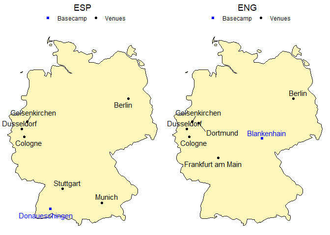

# European Football Championship 2024

- [Quantitative Comparison of Spain vs
  England](#quantitative-comparison-of-spain-vs-england)
  - [A Head to Head History](#a-head-to-head-history)
  - [Mapping the Journey](#mapping-the-journey)
  - [Descriptive Analytics](#descriptive-analytics)
  - [Conclusion](#conclusion)
  - [References](#references)

<details>
<summary>Code</summary>

``` r
# Parameters are set in yaml header and retrieved here
my_teams <- 
  tibble(
    code = c(params$code_a, params$code_b),
    fullname = c(params$fullname_a, params$fullname_b))

# # Same as
# my_teams <-
#   tibble(
#     code = c("ESP", "ENG"),
#     fullname = c("Spain", "England"))
```

</details>

## Quantitative Comparison of Spain vs England

The clash between Spain and England in the Euro 2024 final is set to be
a thrilling and highly anticipated match. Check out this quantitative
comparison between the two teams.

### A Head to Head History

<details>
<summary>Code</summary>

``` r
matches_pivoted <- all_matches %>%
  rowid_to_column("id_match") %>%
  pivot_longer(cols = c(-id_match, -date, -tournament, -city, -country, -neutral),
               names_to = c("Location", ".value"),
               names_pattern = "(home|away)_(.*)")

matches_pivoted_joined <- matches_pivoted %>%
  left_join(select(matches_pivoted, id_match, team, score),
            join_by(id_match),
            suffix = c("", "_against"),
            # set relationship to silence the warning
            relationship = "many-to-many") %>%
  filter(team != team_against)

matches_head_to_head <- matches_pivoted_joined %>%
  filter(team == my_teams[[1, 2]],
         team_against == my_teams[[2, 2]],
         # Filter only for past matches
         as_date(date) < today()) %>%
  mutate(winner= case_when(score > score_against ~ my_teams[[1, 2]],
                            score < score_against ~ my_teams[[2, 2]],
                            score == score_against ~ "Draw"))

first_match <- matches_head_to_head %>% 
  filter(date == min(date))
```

</details>

Both teams have a storied history. Their first match ever played was a
Friendly match in 1929 in the city of Madrid: Spain vs England 4:3.

Here is their head to head performance since then.

<details>
<summary>Code</summary>

``` r
# Compute score to introduce in chart subtitle
score_head_to_head <- matches_head_to_head %>% 
  group_by(team, team_against) %>% 
  summarize(score_sum = sum(score),
            score_against_sum = sum(score_against)) %>% 
  ungroup()

decades <- seq(min(year(matches_head_to_head$date)) %/% 10 * 10, 2020, 10)

plot_data <- matches_head_to_head %>%
  group_by(decade = year(date) %/% 10 * 10, winner) %>%
  count() %>% 
  ungroup() %>% 
  # Introduce n=0 for all decades present in the data (where matches were played)
  complete(decade, winner, fill = list(n = 0)) %>% 
  # Make sure to introduce also decades where no matches where played
  mutate(decade = factor(decade, levels = decades)) %>% 
  complete(decade)

# Pie chart
pie_chart_data <- plot_data %>%
  filter(!is.na(winner)) %>% 
  group_by(winner) %>% 
  summarise(n = sum(n))

# Compute the position of labels for pie chart
pie_chart_data_y_pos <- pie_chart_data %>% 
  arrange(desc(winner)) %>%
  mutate(prop = n / sum(pie_chart_data$n) * 100) %>%
  mutate(ypos = cumsum(prop) - 0.5 * prop)

color_values <- c("darkorange", "darkgrey", "azure2")
names(color_values) <- c(my_teams[[1, 2]], "Draw", my_teams[[2, 2]])

pie_chart_data_y_pos %>%
  ggplot(aes(x = "", y = prop , fill = winner)) +
  geom_bar(stat = "identity", width = 1) +
  coord_polar("y") +
  theme_void() + 
  theme(legend.position = "none") +
  geom_text(aes(y = ypos, label = if_else(winner != "Draw", paste0(winner, "\n", n, "\n", "Wins"), paste0(n, "\n", winner, "s")))) +
  labs(title = paste0(score_head_to_head[[1,1]], " vs ",
                      score_head_to_head[[1,2]]),
       subtitle = paste0("Goals\n",
                         score_head_to_head[[1,3]], " : ",
                         score_head_to_head[[1,4]])) +
  theme(plot.title = element_text(hjust = 0.5),
        plot.subtitle = element_text(hjust = 0.5)) +
  scale_fill_manual(values = color_values)
```

</details>


England won 3 matches more than Spain. These date back to the 1960s,
when England won its only championship to date. Since then, the
performance has been very even, with a slight advantage in favour of
Spain.

<details>
<summary>Code</summary>

``` r
plot_data_no_matches <- plot_data %>% 
  filter(is.na(winner)) %>% 
  mutate(text = "No matches played in this decade")

plot_data %>% 
  filter(n != 0) %>% 
  mutate(winner = fct_relevel(winner, c(my_teams[[1, 2]], "Draw", my_teams[[2, 2]]))) %>% 
  ggplot(aes(x = paste0(decade, "s"), y = n, fill = winner)) +
  geom_col(position = "fill") +
  geom_text(aes(label = paste0(winner, "\n", n)),
            position = position_fill(vjust = 0.5),
            size = 3.5) +
  geom_text(data = plot_data_no_matches, aes(x = paste0(decade, "s"), y = 0.5, label = text)) +
  labs(x = "",
       y = "",
       title = "Head to Head Results per Decade") +
  theme_minimal() +
  theme(legend.position = "none",
        plot.title = element_text(hjust = 0.5),
        plot.subtitle = element_text(hjust = 0.5),
        axis.text.x = element_blank(),
        axis.ticks.x = element_blank()) +
  coord_flip() +
  scale_fill_manual(values = color_values)
```

</details>


The history of wins illustrates this.

<details>
<summary>Code</summary>

``` r
# Change "azure2"-color value of line chart for better visibility
line_color_values <- c("darkorange", "darkgrey", "cadetblue")
names(line_color_values) <- c(my_teams[[1, 2]], "Draw", my_teams[[2, 2]])

plot_data %>%
  filter(winner != "Draw") %>% 
  ggplot(aes(x = decade,
             # Offset lines to avoid overlapping
             y = if_else(winner == my_teams[[1, 2]], n + 0.01, n - 0.01),
             color = winner, group = winner)) +
  geom_line(position = , linewidth = 1) +
  geom_point() +
  geom_text_repel(aes(label = n,
                # Offset text team 1 above and team 2 below line
                vjust = if_else(winner == my_teams[[1, 2]], -1, 1.75)),
            size = 5,
            # To suppress the line joining label to point
            segment.color = NA,
            show.legend = FALSE) +
  labs(x = "Decade",
       y = "Number of Wins",
       color = "",
       title = "A History of Wins Against Each Other") +
  scale_y_continuous(limits = c(-0.5, max(plot_data$n, na.rm = T) + 2)) +
  theme(plot.title = element_text(hjust = 0.5),
        plot.subtitle = element_text(hjust = 0.5),
        axis.text.y = element_blank(),
        axis.ticks.y = element_blank()) +
  scale_color_manual(values = line_color_values) +
  theme_minimal()
```

</details>


### Mapping the Journey

Back to the present, here are the teams’ venues and training camps
across the Euro 2024.

<details>
<summary>Code</summary>

``` r
# Write function for plotting
plot_team_journey <- function(team, show_legend = TRUE) {
  match_data <- euro_2024_matches %>% 
    filter(home_team_code == team | away_team_code == team) %>% 
    # since we use geom_text_repel() a city would be plotted twice in different positions
    distinct(stadium_city, .keep_all = TRUE)
  
  basecamp_data <- filter(basecamps, team_code == team)
  
  ggplot() +
    # Plot German map with map package data
    geom_polygon(data = germany,
                 aes(x = long, y = lat, group = group),
                 colour = "grey10", fill = "#fff7bc") +
    geom_point(data = match_data,
               aes(x = stadium_longitude, y = stadium_latitude, color = "Venues")) +
    geom_point(data = basecamp_data,
               aes(x = long, y = lat, color = "Basecamp"), shape = 15) +
    geom_text_repel(data = basecamp_data,
              aes(label = basecamp, x = long, y = lat, color = "Basecamp"),
              show.legend = FALSE) +
    geom_text_repel(data = match_data,
              aes(label = stadium_city, x = stadium_longitude, y = stadium_latitude, color = "Venues"),
              show.legend = FALSE) +
    scale_color_manual(name = "",
                       values = c("Venues" = "black", "Basecamp" = "blue")) +
    theme_void() +
    # Use paste() function to enquote team variable
    ggtitle(paste0(team)) +
    theme(plot.title = element_text(hjust = 0.5),
          legend.position = "top")
}

# Show both plots in the same pane
grid.arrange(plot_team_journey(my_teams$code[1]),
             plot_team_journey(my_teams$code[2]),
             ncol = 2)
```

</details>



### Descriptive Analytics

<details>
<summary>Code</summary>

``` r
euro_2024_matches_pivoted <- euro_2024_matches %>%
  filter(date < params$match_day) %>% 
  select(id_match, starts_with("home"), starts_with("away")) %>% 
  pivot_longer(
    # pivot all columns except id_match
    cols = -id_match,
    # split into multiple columns 
    names_to = c("Location", # receives the values "home" or "away"
                 ".value"), # the remaining part of the column names should become the names of the new columns
    names_pattern = "(home|away)_(.*)") # how to split into multiple columns (".*" matches the ".value" from before)

euro_2024_matches_pivoted_joined <- euro_2024_matches_pivoted %>% 
  left_join(euro_2024_matches_pivoted,
            join_by(id_match),
            suffix = c("", "_against"),
            # set relationship to silence the warning
            relationship = "many-to-many") %>%
  filter(team != team_against)
```

</details>

**Scoring dynamics**: comparing the number of goals scored and received
by each team throughout the current tournament.

<details>
<summary>Code</summary>

``` r
euro_2024_matches_pivoted_joined_goal_summary <- euro_2024_matches_pivoted_joined %>% 
  filter(!is.na(score)) %>% 
  group_by(Team = team) %>% # group_by() and rename
  summarise(
    `Matches played` = n(),
    `Goals scored` = sum(score),
    `Goals received` = sum(score_against),
    `Goals scored per match` = mean(score),
    `Goals received per match` = mean(score_against))

euro_2024_matches_pivoted_joined_goal_summary %>% 
  select(1:4) %>% 
  filter(Team %in% c(my_teams$fullname)) %>% 
  kable()
```

</details>

| Team    | Matches played | Goals scored | Goals received |
|:--------|---------------:|-------------:|---------------:|
| England |              6 |            6 |              4 |
| Spain   |              6 |           12 |              3 |

Let’s put this performance in visual relation to all other teams.

<details>
<summary>Code</summary>

``` r
euro_2024_matches_pivoted_joined_goal_summary %>% 
  ggplot(aes(x = `Goals scored per match`,
             y = `Goals received per match`)) +
  geom_point(aes(colour = Team %in% c(my_teams$fullname),
                 size = Team %in% c(my_teams$fullname))) +
  geom_text_repel(aes(label = Team,
                      colour = Team %in% c(my_teams$fullname)),
                  nudge_y = .05) +
  scale_size_manual(values = c(2, 3)) +
  scale_color_manual(values = c("black", "red")) +
  theme(legend.position = "none")
```

</details>


**Inside the teams**: what are their strengths and weaknesses?

For each team, we look at the average per player of

- International appearances (caps): reflecting a player’s experience and
  consistency at the international level.
- Goals (in international matches): indicating a team’s offensive
  capability.
- Market value: providing insight into each player’s perceived worth
  based on market demand.
- Height: a strategic factor that was highlighted by former German
  national keeper Jens Lehmann as a disadvantage for Spain’s team before
  playing against Germany. They won anyways, so how much does height
  really matter when comparing two teams?
- Age: indicating the balance between youthful energy and veteran
  experience.

<details>
<summary>Code</summary>

``` r
euro_2024_players_summary <- euro_2024_players %>% 
  group_by(Country) %>% 
  summarise(avg_caps = round(mean(Caps)),
            avg_goals = round(mean(Goals)),
            avg_value = round(mean(MarketValue)),
            avg_height = round(mean(Height)),
            avg_age = round(mean(Age)))

euro_2024_players_summary %>% 
  filter(Country %in% my_teams$fullname) %>% 
  transmute(
    Country,
    `Caps` = avg_caps,
    `Goals` = avg_goals,
    `Market Value (M€)` = round((avg_value / 1000000)),
    `Height (cm)` = avg_height,
    `Age` = avg_age) %>% 
  kable()
```

</details>

| Country | Caps | Goals | Market Value (M€) | Height (cm) | Age |
|:--------|-----:|------:|------------------:|------------:|----:|
| England |   25 |     4 |                58 |         182 |  26 |
| Spain   |   21 |     4 |                37 |         182 |  27 |

For a clearer picture, here’s a visual breakdown.

<details>
<summary>Code</summary>

``` r
# Write function to bind_rows regardless of column names
# Thanks to https://exploratory.io/note/kanaugust/How-to-Force-Merging-Rows-Ignoring-Columns-Names-xpI8bqI4Tm
force_bind <- function(tbl1, tbl2) {
  colnames(tbl2) = colnames(tbl1)
  bind_rows(tbl1, tbl2)
}

euro_2024_players_summary_filtered <- euro_2024_players_summary %>% 
  filter(Country %in% my_teams$fullname)

radarchart_data <- euro_2024_players_summary_filtered %>% 
  force_bind(
    euro_2024_players_summary %>% 
      summarise("0_max", # For sorting later
                max(avg_caps),
                max(avg_goals),
                max(avg_value),
                max(avg_height),
                max(avg_age))) %>% 
  force_bind(
    euro_2024_players_summary %>% 
      summarise("1_min", # For sorting later
                min(avg_caps),
                min(avg_goals),
                min(avg_value),
                min(avg_height),
                min(avg_age))) %>% 
  # arrange() to get maximum values as row 1 and minimum values as row 2
  arrange(Country) %>%
  select(-Country)

# Set the plot dimensions (width, height)
par(pin = c(5, 5))

colours <- c("blue", "red")

radarchart_data %>% 
  radarchart(
    # custom polygon
    pcol = colours,
    pfcol = adjustcolor(colours, alpha.f = 0.3),
    plwd = 2,
    plty = 1,
    vlabels=c("Caps", "Goals", 
              "Market Value", "Height", "Age"),
    # custom the grid
    cglcol = "#000000",
    cglty = 1,
    axislabcol = "#000000",
    cglwd = 1
    )

mtext(paste0(my_teams$fullname, collapse = " vs "), side = 3, line = 0.5, cex = 2, at = 0, font = 1,
      col = "#000000")

legend("topright",
       bty = "n", # to avoid a box around the plot
       legend = euro_2024_players_summary_filtered$Country, # get values like this to make sure the order corresponds to color values
       col = colours,
       lty = 1,
       lwd = 5)
```

</details>


**Spotlight on the stars**: who are the key players?

<details>
<summary>Code</summary>

``` r
euro_2024_players_max_goals <- euro_2024_players %>%
  group_by(Country) %>% 
  filter(Goals == max(Goals)) %>% 
  ungroup()

euro_2024_players_max_caps <- euro_2024_players %>%
  group_by(Country) %>% 
  filter(Caps == max(Caps)) %>% 
  ungroup()

euro_2024_players_max_value <- euro_2024_players %>%
  group_by(Country) %>% 
  filter(MarketValue == max(MarketValue)) %>% 
  ungroup()

caps_fct <- function(team) {
  euro_2024_players_max_caps %>%
    filter(Country %in% team) %>%
    glue_data("{Name} with {Caps} Caps")
}

goals_fct <- function(team) {
  euro_2024_players_max_goals %>%
    filter(Country %in% team) %>%
    glue_data("{Name} with {Goals} Goals")
}

value_fct <- function(team) {
  euro_2024_players_max_value %>%
    filter(Country %in% team) %>%
    mutate(MarketValue = MarketValue / 1000000) %>% 
    glue_data("{Name} with {MarketValue} M€ of market value")
}
```

</details>

- Spain:
  - Player with the most international appearances: Álvaro Morata with
    72 Caps.
  - Player with the most goals scored: Álvaro Morata with 34 Goals.
  - Player with the highest market value: Rodri with 120 M€ of market
    value.
- England:
  - Player with the most international appearances: Harry Kane with 91
    Caps.
  - Player with the most goals scored: Harry Kane with 63 Goals.
  - Player with the highest market value: Jude Bellingham with 180 M€ of
    market value.

### Conclusion

The championship trophy is supposed to be coming home to England. I
strongly anticipate it’s not coming home. It’s going to Spain. And it’s
going to stay there for the next 4 years.

We’ll know who wins the Euro 2024 on Sunday.

### References

- `euro_2024_matches.csv` downloaded from <a
  href="https://www.kaggle.com/datasets/piterfm/football-soccer-uefa-euro-1960-2024"
  target="_blank">Kaggle - dataset name: Football - Soccer - UEFA EURO,
  1960 - 2024</a>.
- `euro_2024_players.csv` (player statistics from before the European
  Championship) downloaded from <a
  href="https://www.kaggle.com/datasets/damirdizdarevic/uefa-euro-2024-players"
  target="_blank">Kaggle - dataset name: UEFA EURO 2024 - Players</a>.
- `all_matches.csv` downloaded from <a
  href="https://www.kaggle.com/datasets/martj42/international-football-results-from-1872-to-2017"
  target="_blank">Kaggle - dataset name: International football results
  from 1872 to 2024</a>.
